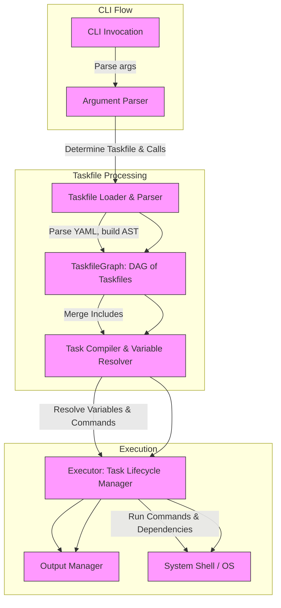

# Execution Flow and System Architecture

Understanding how Task handles your automation requests from the moment you invoke it through the CLI until your tasks execute is key to mastering its power and flexibility. This guide walks you through the core runtime architecture and execution flow, explaining how Task coordinates command parsing, task resolution, variable management, concurrency, and output processing to deliver seamless automation experiences.

## The Execution Journey: From CLI Invocation to Task Execution

When you run Task, the system starts by parsing command-line arguments, interpreting which Taskfile(s) to use, what tasks to run, and what variables or flags have been provided. It automatically locates or loads the appropriate Taskfile, including any nested Taskfiles specified in includes, and compiles them into a unified set of tasks ready for execution.

Next, it resolves the variables and environment, dynamically interpolating values with support for references, shell commands within variables, or environment overrides. When tasks involve dependencies or multiple commands, Task orchestrates the execution order with concurrency where possible, while respecting dependencies and controlling output formatting as configured.

This flow ensures that your tasks are executed efficiently, accurately, and predictably, allowing you to focus on defining your automation logic without worrying about execution details.

## Core Components and Their Roles

At the heart of Task’s runtime architecture are several key components working in concert:

- **CLI Argument Parser:** Interprets flags, task names, and variable assignments supplied by the user, dividing them into positional task calls and global variables.

- **Taskfile Loader and Parser:** Loads Taskfile(s) from local files, remote sources, or stdin, parsing the YAML into an abstract syntax tree (AST) representation. This AST captures the full structure of tasks, dependencies, variables, environment settings, and includes.

- **TaskfileGraph:** Represents included Taskfiles and their relationships as a directed acyclic graph to manage inclusion, namespace resolution, and version compatibility. The graph facilitates merging included Taskfiles into a single unified view.

- **Compiler and Variable Resolver:** Processes each task by interpolating variables, resolving dynamic commands in variables, handling variable references, and processing special Task variables (like `.CLI_ARGS`). It applies templating and expands constructs like loops and matrix expansions.

- **Executor:** Controls the actual lifecycle of task execution. It handles the execution of commands within each task, manages preconditions, supports deferred commands for cleanup, enforces platform-specific execution, and handles concurrency with dependency resolution.

- **Output Manager:** Manages how command output is presented, supporting modes like interleaved, grouped, or prefixed outputs to maintain clear logs even with parallel execution.

## How Task Resolves and Runs Your Tasks

When you request one or more tasks on the CLI, Task compiles those task calls into fully resolved task instances. For each task call, it finds the corresponding task definition, applies variable interpolation with respect to CLI variables, environment variables, and included Taskfile context.

Dependencies specified in a task are evaluated next. Task supports parallel execution of dependencies to optimize runtime, so independent dependencies run concurrently, while respecting order when dependencies depend on one another.

Commands within tasks can include loops (`for`), deferred commands (`defer`), platform restrictions, and other modifiers. Each command undergoes templating with interpolated variables before execution to reflect your dynamic parameters.

If commands or dependencies have preconditions or status checks, these are validated before execution to avoid unnecessary or unsafe runs.

Your tasks run within specific directories as configured, inheriting environment variables from global and task scopes, plus any loaded from `.env` files when specified with the `dotenv` setting.

Throughout this flow, Task carefully propagates error states, signals, and exit codes to ensure predictable failure handling and allows for silent modes or verbose output as configured.

<Tip>
To see your task graph including includes and dependencies, you can use the internal `TaskfileGraph` visualization (`Visualize` method) to generate DOT graph output. This aids in understanding complex compositions.
</Tip>

## Coordination Across Modules: High-Level Architecture Diagram

This diagram highlights how user input flows through system components, building the execution context before delegating to the OS for actual command runs.

## Real-World Scenario: Running a Task with Includes and Variables

Consider you have a main Taskfile that includes a set of utility tasks from another Taskfile under a namespace. When you invoke `task utils:build`, Task proceeds as follows:

Your CLI argument parser identifies `utils:build` as the target task.

The loader reads both the main and included Taskfiles, forming a `TaskfileGraph` reflecting the inclusion and dependencies.

The graph merges included Taskfiles into a unified `Taskfile` where variables and tasks from included files are namespaced.

The compiler resolves variables from both Taskfiles, applies CLI-provided overrides, and prepares the task instance.

The executor ensures that any dependencies of `utils:build` run first, launching those in parallel where possible.

Commands execute in the right order and directory context with environment variables, producing output according to your configured preferences.

Errors or preconditions are respected throughout this process, ensuring smooth and predictable automation.

<Tip>
Leveraging includes with variables and namespaces enables powerful reuse of automation code across projects and teams.
</Tip>

## Practical Tips and Common Pitfalls

Mastering Task’s execution model can be accelerated by remembering:

- Variable precedence can be complex; CLI overrides and included Taskfile scopes matter.
- Platform filtering affects what tasks and commands run; confirm your tasks are not being inadvertently skipped.
- Dependencies run in parallel, so avoid creating circular dependencies or implicit ordering assumptions.
- Use `defer` to clean resources regardless of earlier failure.
- Output modes greatly affect readability in parallel runs—experiment to find what fits your workflow.
- Watch mode and file fingerprinting can help reduce unnecessary runs when managing long-lived automation.

Careful structuring and understanding these flow characteristics will help avoid unexpected behaviors during execution.

<Note>
This guide focuses on the runtime behavior and architecture visible to users and integrators, abstracting away lower-level implementation details.
</Note>

<Source url="https://github.com/go-task/task" paths={[{"path": "cmd/task/task.go", "range": "1-160"},{"path": "variables.go", "range": "1-140"},{"path": "taskfile/ast/graph.go", "range": "1-70"}]} />
