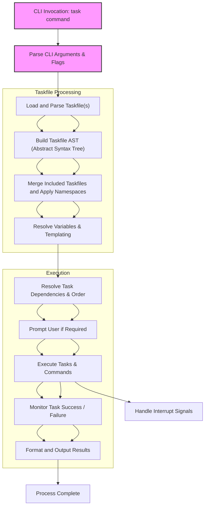

## Understanding Task’s Architecture at a Glance

Task empowers users to automate and orchestrate development workflows by defining tasks declaratively in a YAML-based Taskfile. The architecture behind Task gracefully balances flexibility with simplicity, enabling efficient parsing of task definitions, dynamic variable management, and orderly execution of interdependent tasks — all wrapped within an intuitive command-line interface.

This page unveils this streamlined architecture from the initial CLI invocation through to the full execution lifecycle. Familiarizing yourself with these core components clarifies how Task manages the complexity of automation behind the scenes, ensuring your tasks run predictably and efficiently.

## Core Components and Their Roles

At its heart, Task is composed of several core modules working in concert: the CLI entry-point, the Taskfile parser, the in-memory task model, the variable resolver, the execution engine, and user input integration.

When you run Task via the CLI, the application begins by parsing command-line arguments to determine which tasks to execute and which global variables to apply. It then locates and parses your Taskfile, including any included Taskfiles, producing an internal, structured representation of all task definitions, variable declarations, and dependencies.

Variables declared globally or at the task level are dynamically resolved using Task’s templating system, which supports both static values and outputs of shell commands, enabling highly dynamic task orchestration. Tasks are resolved in terms of their dependencies, ensuring that prerequisites run first and in parallel when possible, providing accurate and efficient task execution order.

To run your tasks, the execution engine invokes shell commands while respecting environment variables, platform-specific constraints, and any conditional logic or task-specific options such as silent mode or prompting for confirmation. Throughout this lifecycle, Task gracefully handles interruptions, errors, and status tracking, allowing robust automation pipelines.



## Task Execution in Real Situations

Imagine you want to automate your build and test workflow. Upon running `task test`, the CLI parses this input and loads your `Taskfile.yml`. It reads all task definitions including dependencies such as `lint` and `build` tasks, merging them seamlessly with any included Taskfiles.

Next, variables like `CLI_ARGS` are populated from your input parameters, adapting command details dynamically. The engine evaluates dependencies — for example, it ensures `build` completes before launching the test suite.

Before executing potentially destructive tasks, Task may prompt for user confirmation if configured. Then tasks execute in order, commands run with environment variables set, leveraging shell behaviors standardized by Task’s POSIX-compliant command interpreter.

If you execute a long `build` task on a supported platform, Task can manage output streams with options to group or prefix messages, reducing console noise while still providing real-time feedback. If you interrupt the process, Task handles signals to clean up resources or stop gracefully.

Here’s a simplified snippet showing variable interpolation and task calls within the `Taskfile.yml`:

```yaml
version: '3'
tasks:
  default:
    cmds:
      - task: lint
      - task: test

  lint:
    cmds:
      - golangci-lint run

  test:
    deps: [build]
    cmds:
      - go test ./... {{.CLI_ARGS}}

  build:
    cmds:
      - go build -o ./bin/myapp ./cmd/myapp
```

This configuration demonstrates how task chaining, variable expansion, and dependencies come together in practice to coordinate automation flows smoothly.

## Getting Started Preview and Next Steps

Getting your first Taskfile running takes just a few simple steps. After installing Task, initializing a new Taskfile with `task --init` creates a foundation for defining your tasks. You will then edit this YAML file to list commands, variables, and dependencies tailored to your project.

To dive deeper into defining tasks and handling variables, consult the [Getting Started Guide](/getting-started). For practical examples illustrating task dependencies and advanced templating, see [Defining Tasks, Variables, and Dependencies](/guides/core-workflows/tasks-vars-dependencies).

This architectural overview sets the stage for exploring Task’s powerful features through hands-on guides and detailed references.

<Source url="https://github.com/go-task/task" paths={[{"path": "cmd/task/task.go", "range": "1-110"}]} />