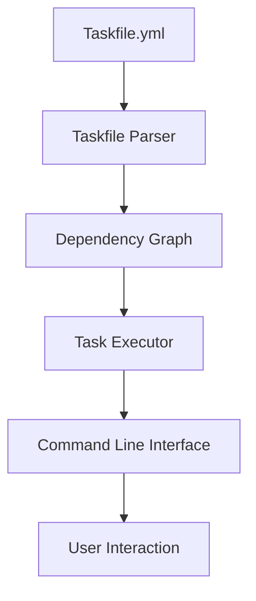

## Discover Task's Powerful Features: Streamline Your Automation with Confidence

When managing automation workflows, clarity and control are paramount. Task empowers you to define, orchestrate, and run tasks effortlessly using a simple YAML syntax, combining versatility with precision. Whether you are building complex pipelines or quick utility commands, Task’s feature set helps you maintain scalable, maintainable automation that adapts to any environment and project size.

At the heart of these capabilities lies a clean CLI-first approach, prioritizing speed and developer experience while ensuring cross-platform compatibility and extensibility. By exploring Task’s feature highlights, you will gain practical insight into how intuitive definitions, environment management, task dependencies, inclusion mechanisms, and advanced scripting come together to create a seamless automation platform.

## What Task’s Feature Highlights Offer You

Feature Highlights provide a focused introduction to the key tools and options that make Task unique. This page is crafted for users eager to understand what they can achieve, without needing to dive immediately into full configurations or code samples. It targets developers and DevOps engineers looking to accelerate build automation, simplify integration in CI/CD, or enhance local development workflows with minimal overhead.

By highlighting core features in a concise yet thorough manner, this section acts as a gateway into to Task’s capabilities, complementing other sections like detailed configuration references and step-by-step task creation guides.

## Core Mechanisms Behind Task’s Feature Set

Task operates through declarative YAML files called Taskfiles, where tasks are defined using a structured syntax. Key elements include task definitions, variables scoped to tasks or the environment, and dependencies that map execution order. Variables and environments blend seamlessly, allowing dynamic substitution and conditional logic.

Task’s execution model interprets these YAML Taskfiles, resolves dependencies, and schedules task execution via a performant CLI engine that supports parallelism, concurrency limits, and watch mode. The system understands and evaluates task labels, descriptions, and conditions, ensuring users get clear feedback and precise control.

A simplified view of the feature integration can be modeled as:



This flow captures how Task converts configuration into actionable instructions, assisting users from authoring to execution.

## Feature Highlights in Practical Workflows

Defining tasks in YAML with Task is straightforward, whether your task requires simple shell commands or complex multi-step logic. Taskfiles allow adding descriptive labels and multi-line descriptions which improve clarity at a glance—helpful when running `task --list` or generating documentation.

Managing variables is seamless. You can define environment variables globally or per task, leveraging Task’s templating for dynamic values. This eliminates the need for hacky scripting and lets you reuse values safely across your workflow.

Task handles dependencies elegantly. You specify task dependencies declaratively, ensuring prerequisite tasks run first without manual orchestration. This guarantees reliable, repeatable builds or deployments.

Include support allows Taskfiles to incorporate other Taskfiles, facilitating modular workflows and sharing task definitions across projects or teams. This is especially valuable for monorepos or multi-component projects.

Built-in support for cross-platform compatibility means the same Taskfile works consistently on Windows, macOS, and Linux. Advanced scripting capabilities let you embed complex logic within your tasks using popular shell constructs and Task’s own advanced features.

Consider this snippet showcasing task definition clarity and dependency declaration:

```yaml
version: '3'
tasks:
  build:
    desc: "Compile the project binaries"
    cmds:
      - go build -o bin/myapp ./cmd/myapp
  test:
    desc: "Run unit tests"
    deps:
      - build
    cmds:
      - go test ./... -v
```

Here, `test` depends on `build`, and both tasks contain readable descriptions and straightforward command arrays. Task ensures `build` runs before `test`, preventing costly errors.

## Preparing To Leverage These Features

To start exploring and using these highlights, initiate by creating or opening your Taskfile (typically `Taskfile.yml`). Familiarize yourself with basic YAML syntax and the Taskfile structure. The Getting Started guide will walk you through initial setup and running basic tasks.

Once comfortable, you can incrementally adopt variables, environment configuration, and task dependencies to build robust automation. Dive deeper with our [Configuration Reference](/reference/config/) for complete option details, and explore [Defining Tasks, Variables, and Dependencies](/guides/core-workflows/tasks-vars-dependencies) for practical examples.

This page is designed to spark understanding and motivate exploration of Task’s rich feature set — the cornerstone of reliable, repeatable automation workflows.

<Source url="https://github.com/go-task/task" branch="main" paths={[{"path": "cmd/task/task.go", "range": "1-200"},{"path": "website/src/docs/reference/config.md", "range": "1-100"}]} />